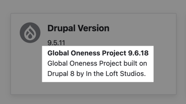
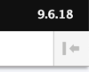

<!--
id: readme
tags: ''
-->

# Web Package

## Summary

Provides a framework for reading project data, namely your project's _version_, into Drupal. For example you may use _composer.json_ as the source of your information; or you can use a standalone YAML file. In all cases it is important that your data file provides the following keys, at least: version, name, description. The data is exposed to developer's through a new service interface. This is a very simple, lightweight module, with a real sense of purpose.

## Features

* Enhances the [Status report](/admin/reports/status) by displaying the project info (name, description, version) above the core version info.  
* Enhances _admin_menu_ by displaying the version in the top bar.  

{{ composer.install|raw }}

## Quick Start

1. Create a file that contains your version, the name of your project and optionally a description.  The examples shows YAML, however several file types are supported (_.yaml, .yml, .json, .info_).

    ```yaml
    version: 1.0.0
    name: My Project
    description: A cool project indeed
    ```

2. Name that file in _settings.php_

    ```php
    $config['web_package.settings']['filepath'] = realpath($app_root . '/../my_project.yml');
    ```

3. Enable this module.
4. Visit _/admin/reports/status_ and find your project information.

## Contributing

If you find this project useful... please consider [making a donation](https://www.paypal.com/cgi-bin/webscr?cmd=_s-xclick&hosted_button_id=4E5KZHDQCEUV8&item_name=Gratitude%20for%20aklump%2Fweb_package).

## Developers

This module does not solve how your version is changed over time, that is up to you. This module only allows the version to be seen and read in code.

### API

To access the version, name and description, use:

```php
$service = \Drupal::service('web_package');
$service->getVersion();
$service->getName();
$service->getDescription();
```

### Cache Busting

To append the version to URLs use:

```php
$url = \Drupal\Core\Url::fromRoute('system.status');
print $service->addCacheBusterToUrl($url)->toString() . PHP_EOL;
// $url === '/admin/reports/status?vs=8.x-1.0'
```

The query string var can be customized in _settings.php_ using:

    $config['web_package.settings']['cache_buster'] = 'cb';

## Upgrade Path Drupal 7 to 8

* Replace all instances of `web_package_filepath` with `\Drupal::service('web_package')->getInfoFilepath()`
* Replace all instances of `web_package_info` with the appropriate getter method, e.g. `getVersion`.
* Replace all instances of `web_package_get_version` with `\Drupal::service('web_package')->getVersion()`
* Replace all instances of `web_package_cache_buster_url` with `\Drupal::service('web_package')->createCacheBusterUrl()`
* In _settings_ file change `$conf['web_package_filepath'] = DRUPAL_ROOT . '/../web_package.info';` to `$config['web_package.settings']['filepath'] = DRUPAL_ROOT . '/../web_package.info'`
* Optionally, convert _web_package.info_ to YAML or JSON, if desired.
